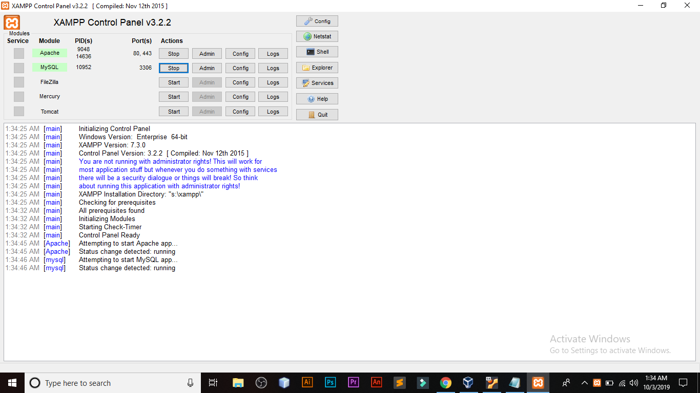

<h2> Introduction </h2>
Web application security is very important in web application development life cycle. International institute of cyber security (<a href = "https://www.iicybersecurity.com/ethical-hacking.html">iicybersecurity</a>) basic ethical hacking course is focus on understanding basic concept realted to web application security among which is SQLi and which is explained through a basic project. This project  will help students understand the very basic of SQLi.

<h2> SQL Injection Tester </h2>

<h3>For Windows users</h3>

Steps to Implement this program:- 

1. GitClone these 2 files (project.html andd projectdb.php).


2. Download xampp server (or any other server where you want to execute html and php file).

<a href = "https://www.apachefriends.org/download.html">Click here to download</a>

Locate xampp in your ```C:\\``` drive and then copy these files in ```htdocs``` folder. 


3. Start mysql and apache services in server:-




4. Create mysql database in php-my-admin with name "project",further in this database create a table with name "users", with column name   as "srno", "name", "city" <br>
  "srno" = type integer and length 5 <br>
  "name" = type varchar and length 30 <br>
  "city" = type varchar and length 30 <br>
  
   After creating table you need to insert some random records in the table. 
   
   Open URL ```localhost/phpmyadmin``` in browser and create new database by name specified above.

5. Run that file (project.html) through server by  typing ```localhost/project.html``` in browser.

6. Test the basic functionality of this program by typing "srno"(serial number) in text field, 
   if the output is showing the details of that "srno" then the basic functionality  is working correctly.
   
   
   
   Output:-
   

7. Now, let's test sql injection:-
  
   Type " a' " in text field, if output is  showing a sql error then this page is sql injected 
    and can be hackable.
    
    
    
    Output:-
    
    
    
    <b>Why this error is coming?</b>
    Because I am using a function you can spot in php code ```(mysqli_error($con))``` , which Return the
    last error description for the most recent function call. If you type ```a'``` in text field it will return an sql syntax error.
    
   Now type some queries given below:-

   1. ```a' and 1=0 union select table_schema, table_type, table_catalog from information_schema.tables;#```
   
   
   
   Output:-
     

   2. ```a' and 1=0 union select table_schema, table_type, table_catalog from information_schema.tables where table_name like 'user%';#```
      
      
        
        
        Output:-
          
     

   3. ``` a' and 1=0 union select concat_WS(':', name), concat_WS(':', srno, city), name, city from user;#  ```
    
     
     
     Output:-
      


<h3>For Linux users</h3>

<b> I am using ubuntu version 18.04 </b>

ISO Download :- <a href = "http://releases.ubuntu.com/18.04/"> Click Here </a> 

Steps to Implement this program:-

Setting up LAMP(Linux, Apache, Mysql, PHP):-

1. If you have a Linux OS then you have already done the first phase of LAMP which is linux.

2. Further, you have to install :-
  Apache
  Command:-
  ```apt-get install apache2```
  Mysql
  Command:-
  ```apt-get install mysql -server```
  pHp
  Command:-
  ```apt-get install php7.2 libapache-mod-php7.2php-mysql```
  PhpMyAdmin
  Command:- 
  ```apt-get install phpmyadmin```

3. Now ,you have to follow some mysql commands:-
  Create database:-
    ```Create database project;```
  Select the created database:-
    ```use project;```
  Create table in database:-
    ```create table users(srno int(5) primary key, name  varchar(30), city varchar(30));```

4. Now gitclone those 2 pages(project.html and projectdb.php) and copy them at following path:-
   ```var/www/html```

5. Now run project.html in browser (localhost/project.html) 

6.  Now, let's test sql injection:-
  
   Type " a' " in text field, if output is  showing a sql error then this page is sql injected 
    and can be hackable.
   Now type some queries given below:-

   1. ```a' and 1=0 union select table_schema, table_type, table_catalog from information_schema.tables;#```

   2. ```a' and 1=0 union select table_schema, table_type, table_catalog from information_schema.tables where table_name like 'user%';#```

   3. ```a' and 1=0 union select concat_WS(':', name), concat_WS(':', srno, city), name, city from user;#```
   
   
   <h2>Prevention to Sql Injection </h2>
   
   1.<b> Don't use dynamic SQL don't construct queries with user input:</b> Even data sanitization routines can be flawed, so use prepared statements, parameterized queries or stored procedures instead whenever possible. 
   
   2. <b>Update and patch:</b> Vulnerabilities in applications and databases that hackers can exploit using SQL injection are regularly discovered, so it's vital to apply patches and updates as soon as practical.
   
   3. <b>Firewall, Consider a Web Application Firewall(WAF):</b> A WAF can be particularly useful to provide some security protection against a new vulnerability before a patch is available. A popular example is the free, open source module ModSecurity, which is available for Apache, Microsoft IIS, and nginx web servers. ModSecurity provides a sophisticated and ever-evolving set of rules to filter potentially dangerous web requests. Its SQL injection defenses can catch most attempts to sneak SQL through web channels.
   
   4.<b>Keep your secrets secret:</b> Assume that your application is not secure and act accordingly by encrypting or hashing passwords and other confidential data, including connection strings.
   
   5.<b>Buy better software:</b> Make code writers responsible for checking the code and for fixing security flaws in custom applications before the software is delivered.
